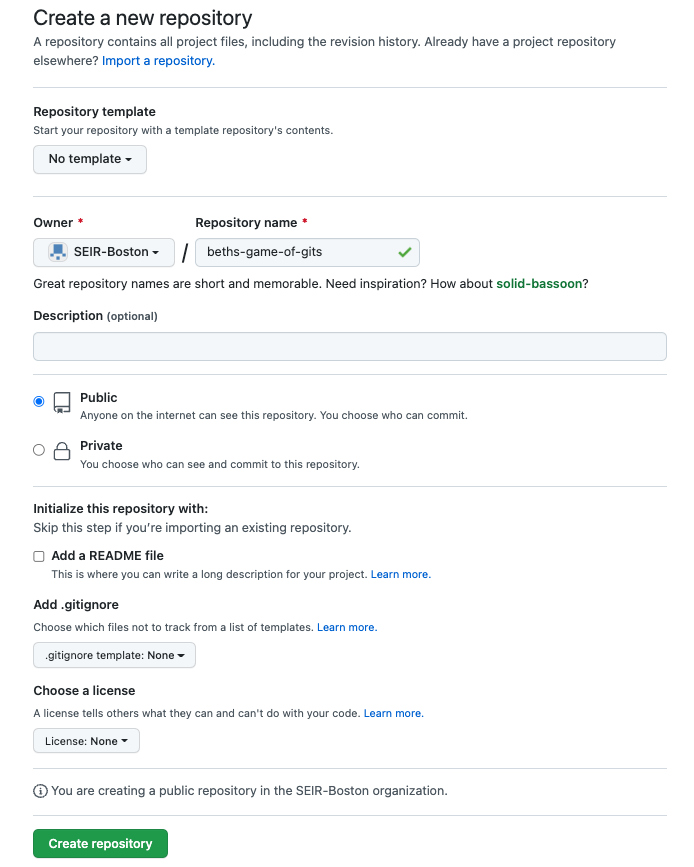
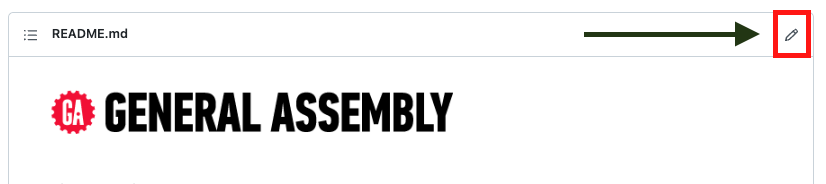

# Git and Github

## Objectives

- Manage changes in a project over time
- Collaborate over time and space with other developers on the same project
- Fork a remote repository to get your own remote copy
- Clone a remote repository to get your own local copy
- Synchronize local and remote repositories

## Prerequisites

- Git

## Overview

Continuing with what we started Git, we are going to use Github to manage our project.

## Demo: Linking with GitHub

So we have a local repository. Watch as I create a GitHub repository. Why GitHub? So we can backup our code online. It also provides us with a useful graphical interface and useful collaboration features.

## Lab: Creating & Pushing

Now create your own GitHub repository:

- Name the repository `game-of-gits-<your name>`
- Set repo to `Public`
- _Do Not_ check the box asking to initialize with a new README

Your Create New Repository screen will look like:



Push your main branch with the command `git push origin main`.

The last time we saw Ned Stark, we had just written his fate.  Below his story write the beginning of another character's story.  For instance:

```md
Joffrey Baratheon was the one to do Ned in, but his story was only about to
begin, and let me assure you he will ___DEFINITELY NOT DIE!___
```

Push the changes you made.

Also, push your `dream-story` branch. We pushed our `main` branch with the command `git push origin main`.  Can you figure out how to push our `dream-story` branch?

## Demo: Adding to Your Story

Watch as I `fork` and `clone` one of your repos and make an addition by creating a `pull request`.

## Lab: Adding to Other's Stories

Working with a partner, follow my example and take turns adding to one another's stories. Accept each other's pull requests. After you've each gone once, stop.

## Pulling: Updating Your Local

Each of you should now have updated code on GitHub, but your local Git repo will be behind. We need to get the latest code off of GitHub. We can do this by pulling the changes that we merged. The command to do this is:

`git pull origin main`

This gets the latest copy of our code off of the main branch of our original repository.

## Editing on GitHub

Hey! See that little pencil button on the top of a page on GitHub!? That looks like it's used to change the text and will help us, right?!



Wrong! DON'T EVER USE THAT! Regardless of how small the changes are, you never want to edit ON GitHub. You always want to make changes locally and push them.

The reason we never want to do that is if you edit in the cloud, our local repo and GitHub repo become out of sync and it breaks convention.

## Additional Resources

- [Git Commands](command-reference.md)
- [Github's fork page](https://help.github.com/articles/fork-a-repo/)
- [An Introduction to Git and GitHub by CS50](https://www.youtube.com/watch?v=MJUJ4wbFm_A)

## [License](LICENSE)

1. All content is licensed under a CC­BY­NC­SA 4.0 license.
2. All software code is licensed under GNU GPLv3. For commercial use or
    alternative licensing, please contact legal@ga.co.
# git-github-lesson
